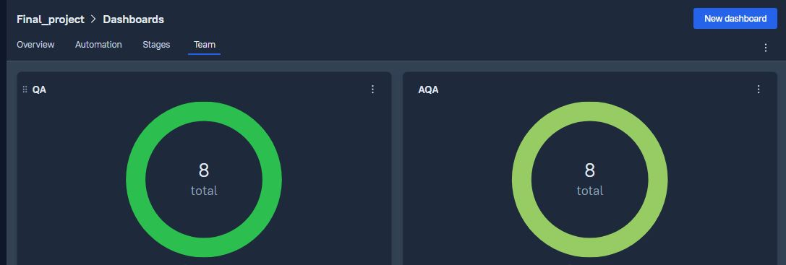
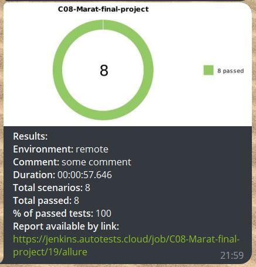

## Automation of UI, API and Mobile tests:
- UI tests for [tutu.ru](https://www.tutu.ru/) web-site
- API tests for [Reqres](https://reqres.in/) web-site
- Mobile tests for Wikipedia android application

### Used technologies:
<table>
<tbody>
<tr>
<td align="center"><src="https://www.jetbrains.com/idea/"> IntelliJ IDEA</td>
<td align="center"><src="https://www.jetbrains.com/idea/"> Java</td>
<td align="center"><src="https://www.jetbrains.com/idea/"> Gradle</td>
<td align="center"><src="https://www.jetbrains.com/idea/"> JUnit5</td>
<td align="center"><src="https://www.jetbrains.com/idea/"> Rest-Assured</td>
</tr>
<tr>
<td align="center"><src="https://www.jetbrains.com/idea/"> Jenkins</td>
<td align="center"><src="https://www.jetbrains.com/idea/"> Github</td>
<td align="center"><src="https://www.jetbrains.com/idea/"> Allure TestOps</td>
<td align="center"><src="https://www.jetbrains.com/idea/"> Jira</td>
<td align="center"><src="https://www.jetbrains.com/idea/"> Telegram Bot</td>
</tr>
</tbody>
</table>

### Test execution:

UI tests execution:

    gradlew clean ui_tests

API tests execution:

    gradlew clean api_tests

Mobile tests execution:

     gradlew clean mibile_tests

### [Jenkins](https://jenkins.autotests.cloud/job/C08-Marat-final-project/) project:
Run Builds Statistics

Сonfiguration

### [Jira](https://jira.autotests.cloud/browse/HOMEWORK-852) integration:

### [Allure](https://allure.autotests.cloud/project/3623/dashboards/) integration:

   

  

### Video of a running test:

### Telegram notification:

