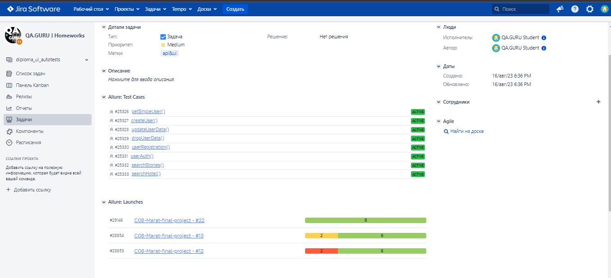
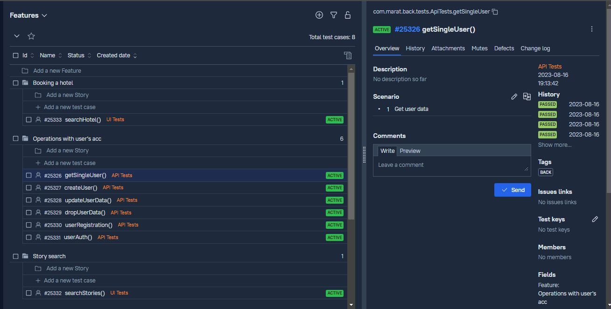
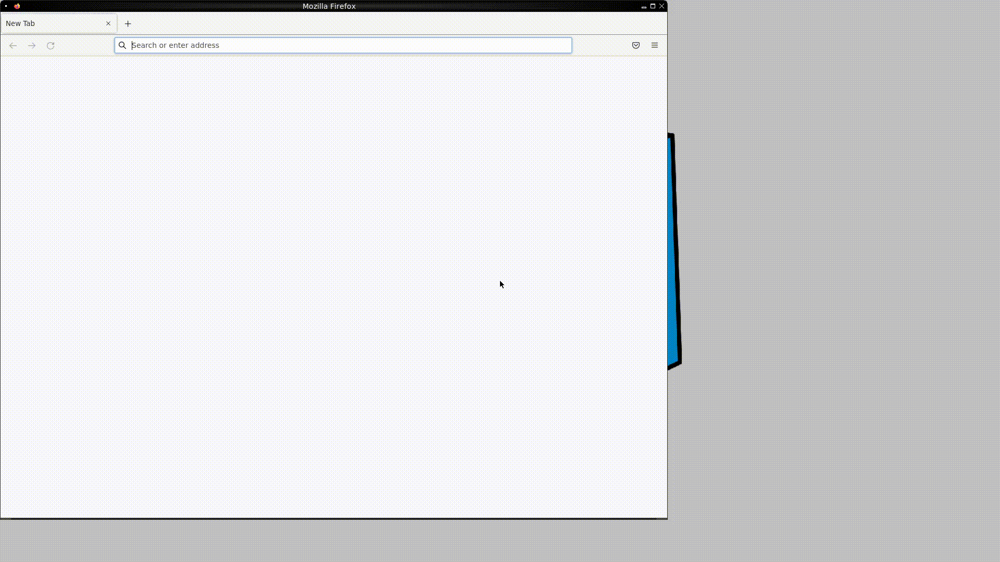
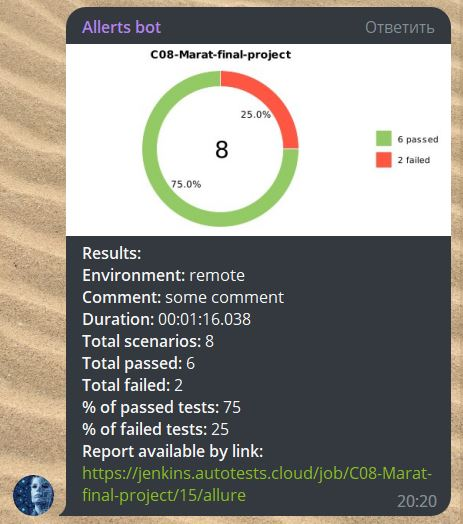

## Automation of UI, API and Mobile tests:
- UI tests for [tutu.ru](https://www.tutu.ru/) web-site
- API tests for [Reqres](https://reqres.in/) web-site
- Mobile tests for Wikipedia android application

### Used technologies:

`Java` `Junit5` `Selenide` `Gradle` `Selenoid` `Jenkins` `Allure Report` `Telegram Bot`

### Test execution:

UI tests execution:

    gradlew clean ui_tests

API tests execution:

    gradlew clean api_tests

Mobile tests execution:

     gradlew clean mibile_tests

### [Jenkins](https://jenkins.autotests.cloud/job/C08-Marat-final-project/) project:
Run Builds Statistics

Сonfiguration

### [Jira](https://jira.autotests.cloud/browse/HOMEWORK-852) integration:

### [Allure](https://allure.autotests.cloud/project/3623/dashboards/) integration:

   

   

### Video of a running test:

### Telegram notification:

